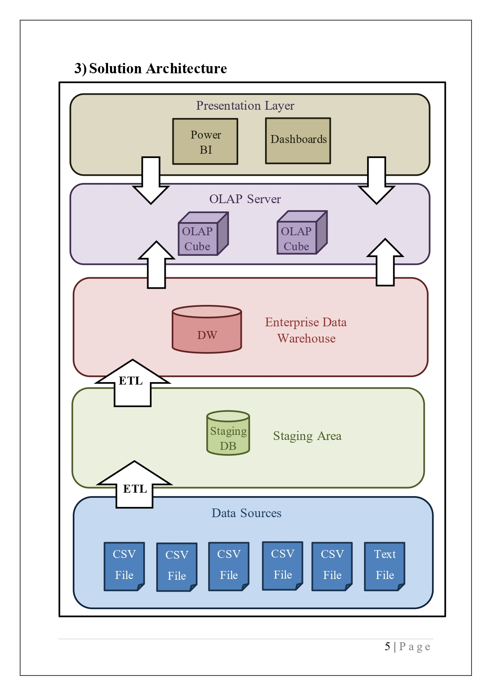

# Data Warehouse & ETL Project – Northwind Traders

## 📌 Overview
This project demonstrates the design and implementation of a Data Warehouse solution using the Northwind Traders dataset. The goal was to transform raw operational data into structured, analysis-ready data.

## 🏗️ Architecture

## ⚙️ Tools & Technologies
- Microsoft SQL Server
- SQL Server Integration Services (SSIS)
- SQL Server Data Tools (SSDT)
- CSV Data Sources

## 🔄 ETL Process
- Extracted data from CSV files and source systems
- Loaded data into a staging layer
- Transformed and loaded into Data Warehouse tables

Key implementations:
- Slowly Changing Dimensions (SCD)
- Lookup transformations for surrogate keys
- Full load & incremental load strategies

## 🧱 Data Model
- Fact and Dimension tables
- Star schema design

## 📊 OLAP & Reporting

### 🔹 OLAP Cube (SSAS)
- Designed a multidimensional cube for fast analytical queries
- Defined measures (e.g., Sales, Quantity)
- Created dimensions and hierarchies (Time, Product, Region)

### 🔹 Excel OLAP Analysis
- Connected Excel to the OLAP cube
- Performed slice, dice, and drill-down operations
- Analyzed trends across multiple dimensions

### 🔹 Power BI Dashboards
- Built interactive dashboards using Power BI
- Visualized:
  - Sales trends over time
  - Regional performance
  - Product-level insights

---

## 🎯 Key Outcomes
- Improved data consistency through staging layer
- Enabled historical tracking using SCD
- Built a complete pipeline: ETL → Data Warehouse → OLAP → Visualization
- Enabled faster analytical queries and decision-making

---

## 📸 Sample Outputs
- OLAP Cube structure
- Excel pivot analysis
- Power BI dashboard

---